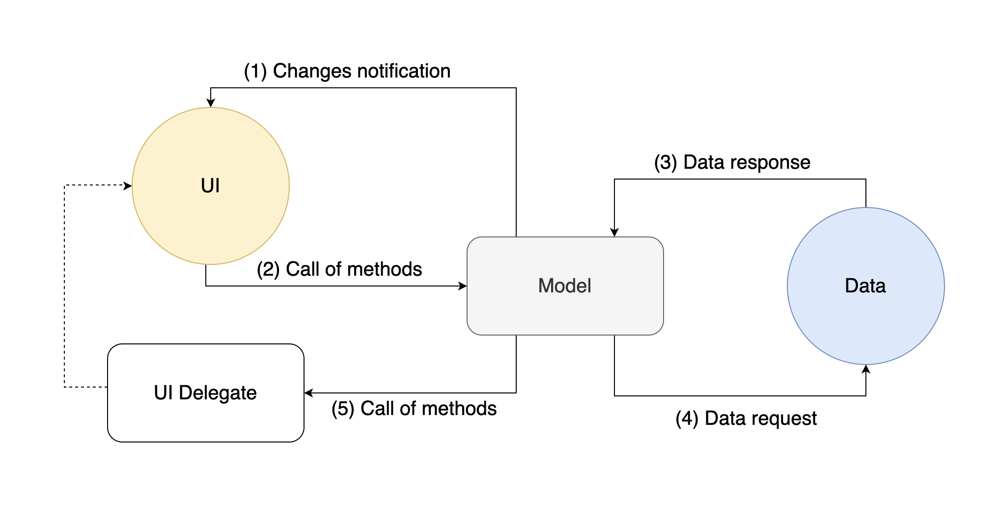
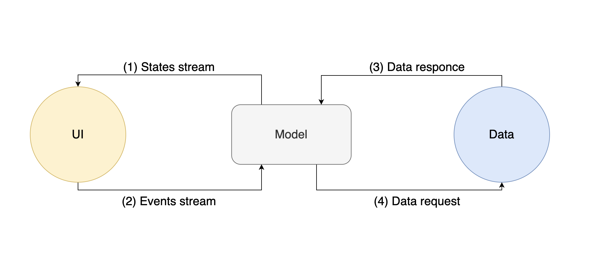

## Overview
It is a blueprint application. This application should be used as an example for your future projects. We are open for new ideas and proposals. If you want to add new features or modify existing components then just make a PR.

Application contains following features:
* Sign in/up using email + password, phone number or Google account. Application uses Firebase authentication service as BE.
* User profile with edit mode. You can change username or photo. Firebase is used as remote storage. 
* Each user has a remote config which is stored inside Firebase DB. Only one field is implemented now (notification on/off) but you can easily extend config.
* Application can store users notes inside Firebase DB. CRUD operations are already implemented. You can reuse it. Just change the data model.
## Repository structure
Repository contains two different architecture approaches. There are `Provider state management` and `BLoC`. It was done to compare them. Each approach located inside separate package. Also `common` package contains common logic for each of them.
## Getting started
Before run project you should:
1. Create Firebase project which support DB, Storage and Auth services. 
2. Generate `google-services.json` and `GoogleService-Info.plist`. 
3. Move `google-services.json` to `/android/app` folder.
4. Move `GoogleService-Info.plist` to `/ios/Runner` folders.

Note: repository contains two Flutter projects. It is required for each of them.
## Provider state management
The core of concept is combination of [Provider DI library](https://pub.dev/packages/provider) and [ChangeNotifier mechanism](https://flutter.dev/docs/development/data-and-backend/state-mgmt/simple). Model is the main component which connect UI and data. Model instance should be independent to UI rebuild. Model lifecycle is equal to widget state. Use `ChangeNotifierProvider` which save model instance during rebuild process.


* **Changes notification**. Your model class extends `ChangeNotifier`. If you want to change UI from model than you should update model fields and call `notifyListeners()` method which rebuild your UI using updated model data.

* **Call of method**. You have access to model methods from UI. Use `Consumer` widget to tie up your model and UI component.

`ChangeNotifierProvider` + `Consumer` example:
```dart
ChangeNotifierProvider(
  create: (context) => YourModel(),
  child: Consumer<YourModel>(
    builder: (_, model, __) {
      switch (model.state) {
        //Return widget related to state type
      }
    },
  ),
)
```
* **Data request/response**. Model is a bridge between your data and UI. Each iteration with data should located inside model. Such as data fetching, data modification or observing of data changes.

Note: **Data** means any data stream such as Networking, DB, Shared preferences or native device components like BLE. Also we recommend to use repository pattern. If needed you can store specific business logic inside components like Services, Use cases, Managers.
* **UI Delegate**. It is component which handle side effects such as Navigation, Snackbars, Toasts, Errors. Please split delegate to interface and implementation classes. Only delegate implementation class contains `BuildContext`.

Delegate example:
```dart
abstract class SignUpDelegate {

  void navigateToHome();

  void navigateToSignIn();

  void showAuthError();
}

class SignUpDelegateImpl extends SignUpDelegate {
  final BuildContext context;

  SignUpDelegateImpl(this.context);

  @override
  void navigateToHome() => Navigator.of(context).popAndPushNamed(HomeWidget.route);

  @override
  void navigateToSignIn() => Navigator.of(context).popAndPushNamed(SignInWidget.route);

  @override
  void showAuthError() => Scaffold.of(context).showSnackBar(
    SnackBar(
      content: Text('Something went wrong. Check your internet connection'),
    )
  );
}
```
## BLoC state management.
